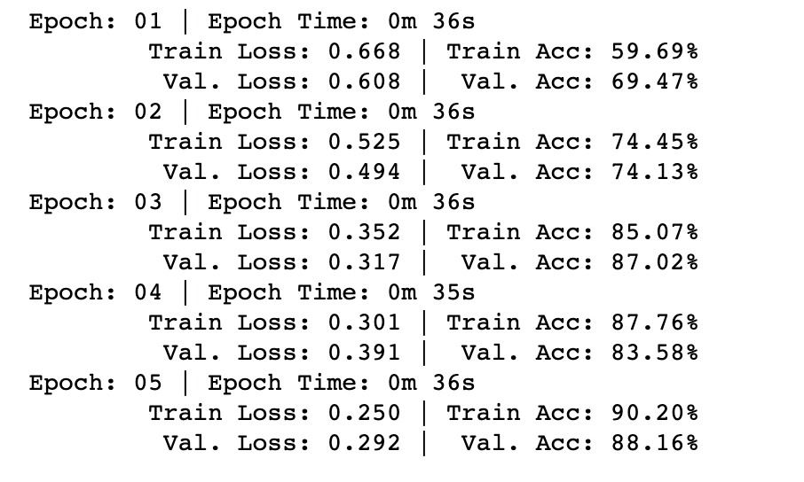
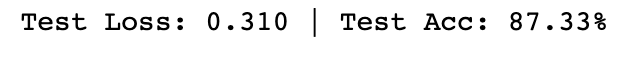

# Assignment 4

**Group Members:**
* Shashank Pathak
* Divyam Shah
* Subramanya Rao

We trained a LSTM Model to detect sentiment (positive or negative) using PyTorch and TorchText on movie reviews dataset(IMDb dataset). We followed the base approach explained in the following notebooks
- [Simple Sentiment Analysis.ipynb](https://github.com/bentrevett/pytorch-sentiment-analysis/blob/master/1%20-%20Simple%20Sentiment%20Analysis.ipynb)
- [Upgraded Sentiment Analysis.ipynb](https://github.com/bentrevett/pytorch-sentiment-analysis/blob/master/2%20-%20Upgraded%20Sentiment%20Analysis.ipynb)

We then modified the code in the upgraded sentiment analysis notebook to have 3 LSTM layers, it has used a for loop to do so in the forward function and the dropout value used is 0.2:
We trained on the IMDB Reviews text which was reversed and got 87.33% test accuracy.Here are the training logs

## Training

## Testing

